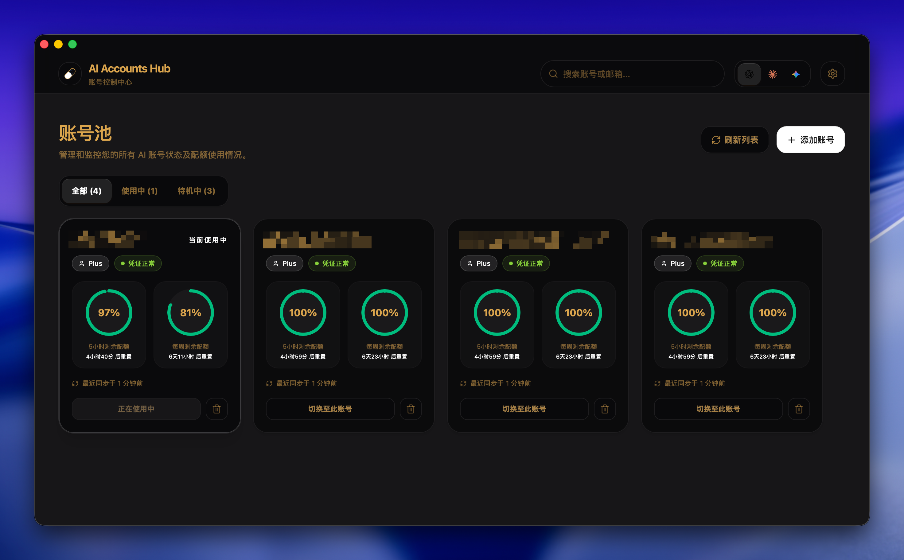

# AI Accounts Hub

一个基于 `Tauri 2 + React 19 + TypeScript` 的桌面应用，用来统一管理 AI CLI 账号、切换当前系统凭证，并同步查看配额状态。

当前版本重点支持：

- `Codex` 多账号管理与切换
- `Gemini` 多账号管理与切换
- 后台真实配额同步
- GitHub Release + Tauri Updater 桌面更新



## 当前能力

| 平台 | 状态 | 能力 |
| --- | --- | --- |
| Codex | 已接入 | 添加账号、账号池、切换当前账号、5 小时 / 每周配额同步、后台定时刷新 |
| Gemini | 已接入 | 添加账号、账号池、切换当前账号、`Pro / Flash / Flash Lite` 配额同步、后台定时刷新 |
| Claude | 未接入 | 仅保留平台入口，尚未实现账号管理 |

## 核心设计

这个项目不是直接把所有账号都堆进系统目录里，而是先把账号托管到应用自己的私有库中，再由你选择一个账号写回系统凭证。

大致流程是：

1. 点击“添加账号”
2. 应用使用隔离的账号 home 拉起登录
3. 登录成功后，把凭证保存到应用私有账号库
4. 点击“切换至此账号”时，再把选中的凭证写回系统目录

对应系统目录：

- Codex 当前系统账号：`~/.codex/auth.json`
- Gemini 当前系统账号：`~/.gemini/oauth_creds.json`

应用私有数据目录由 Tauri `app_data_dir` 决定。

以 macOS 为例，默认位置通常是：

```text
~/Library/Application Support/com.murong.ai-accounts-hub
```

其中会包含：

- `codex/managed-codex-homes/`
- `codex/usage-snapshots.json`
- `gemini/managed-gemini-homes/`
- `gemini/usage-snapshots.json`
- `settings.json`

## 技术栈

- `Tauri 2`
- `React 19`
- `TypeScript`
- `Vite`
- `daisyUI`
- `Rust + reqwest + tokio`

## 本地开发

### 环境要求

- `Node.js 22+`
- `pnpm 10+`
- `Rust stable`
- 对应平台的 Tauri 构建依赖

如果你要实际登录和同步账号，还需要本机安装：

- `codex`
- `gemini`

### 安装依赖

```bash
pnpm install
```

### 启动桌面开发环境

```bash
pnpm tauri dev
```

如果只想跑前端：

```bash
pnpm dev
```

### 构建

```bash
pnpm build
pnpm tauri build
```

## 测试与校验

前端轻量测试：

```bash
node --test src/lib/*.test.ts
```

前端构建校验：

```bash
pnpm build
```

Rust 测试：

```bash
cargo test --manifest-path src-tauri/Cargo.toml
```

CI 当前也基本按这三步执行。

## 自动同步与配额抓取

### Codex

Codex 使用托管账号自己的凭证请求 usage 接口，并把结果写入应用私有快照中。

已接入的展示数据包括：

- 5 小时窗口
- 每周窗口
- 最近同步时间
- 重置倒计时

### Gemini

Gemini 目前按 `CodexBar` 的结构对齐，展示三类额度：

- `Pro`
- `Flash`
- `Flash Lite`

同步时会读取托管 Gemini 账号自己的 `oauth_creds.json`，必要时刷新 token，再抓取真实 quota。

## 设置与数据清理

设置页当前支持：

- 语言切换
- 主题切换（浅色 / 深色 / 跟随系统）
- 配额后台自动同步开关
- 同步间隔调整
- 检查更新与安装更新
- 打开数据目录
- 恢复默认数据目录
- 清空应用托管数据

“清空所有数据”只会清理应用私有库，不会直接删除：

- `~/.codex`
- `~/.gemini`

## 发布

仓库包含：

- `CI` 工作流：基础校验
- `Release` 工作流：多平台构建、生成 updater 资产、发布 GitHub Release

### 本地版本号管理

项目已经接入 `bumpp`：

```bash
pnpm bump
```

### Release 工作流依赖的 Secrets

GitHub Actions 发布至少需要：

- `TAURI_SIGNING_PRIVATE_KEY`
- `TAURI_SIGNING_PRIVATE_KEY_PASSWORD`

Tauri Updater 当前使用的发布源是：

```text
https://github.com/murongg/ai-accounts-hub/releases/latest/download/latest.json
```

如果你修改了仓库地址或 release 策略，需要同步更新：

- `src-tauri/tauri.conf.json`
- `.github/workflows/release.yml`

### macOS

Release 流程里额外包含：

- macOS DMG 重打包
- 修复辅助脚本注入
- updater bundle 签名

相关脚本在：

- `scripts/macos/repack-dmg-with-fix.sh`
- `scripts/macos/fix-ai-accounts-hub.command`

## 项目结构

```text
src/
  components/      UI 组件
  containers/      页面级状态容器
  pages/           页面渲染层
  lib/             前端领域工具与 Tauri 调用封装
  types/           前端类型定义

src-tauri/
  src/
    codex_accounts/  Codex 账号托管与切换
    codex_usage/     Codex 配额抓取与调度
    gemini_accounts/ Gemini 账号托管与切换
    gemini_usage/    Gemini 配额抓取与调度
    app_settings/    设置与数据目录
```

## 当前边界

当前版本仍然有明确边界：

- Claude 尚未接入
- 应用退出后不会继续后台刷新
- 自动同步依赖各平台当前可用的接口和凭证结构
- 这是一个桌面账号管理工具，不是浏览器插件或 Web 服务

## License

如果要开源发布，建议在仓库根目录补充明确的 `LICENSE` 文件。当前仓库还没有声明许可证。
