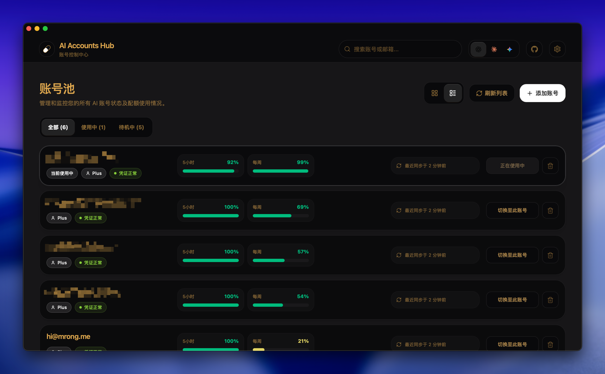

# AI Accounts Hub

一个面向 AI CLI 重度用户的桌面账号中枢。

它把 `Codex`、`Claude`、`Gemini` 的多个登录态收进应用自己的账号池，并在需要时把选中的账号同步回系统 CLI 配置，让你可以在一台机器上快速切换“当前活跃账号”，同时查看各 provider 的配额或 usage 快照。

- 下载地址：[Latest Release](https://github.com/murongg/ai-accounts-hub/releases/latest)
- 项目仓库：[murongg/ai-accounts-hub](https://github.com/murongg/ai-accounts-hub)

> 当前体验以 macOS 为主。原生 menubar / 状态栏能力仅在 macOS 可用；仓库包含其他平台的构建链路，但整体使用体验以 macOS 为准。




## 适用场景

- 同时维护多个 `Codex` / `Claude` / `Gemini` CLI 账号
- 经常在不同账号之间切换当前系统登录态
- 希望在切换前先看到剩余额度、刷新时间或账号健康状态
- 不想手动备份和覆盖 `~/.codex`、`~/.claude`、`~/.gemini` 下的凭证文件

## 已实现功能

- `Codex` / `Claude` / `Gemini` 多账号管理
- 首次启动自动导入当前系统已经登录的账号
- 一键切换当前系统 CLI 正在使用的登录态
- 主界面展示账号状态、剩余额度、刷新时间和 relogin 状态
- 后台定时刷新各 provider 配额快照
- 在主账号不可用或主配额耗尽时自动切换到可用账号
- 设置页支持语言、主题、自动切换、刷新间隔、数据目录管理
- 内置桌面自动更新
- macOS 原生 menubar / 状态栏快速查看和切换

## Provider 支持

| Provider | 多账号池 | 切换系统登录态 | 配额 / Usage 快照 | 自动切换 |
| --- | --- | --- | --- | --- |
| Codex | 支持 | 支持 | `5h` / `Weekly` / `Credits` | 支持 |
| Claude | 支持 | 支持 | `Session` / `Weekly` / `Opus or Sonnet Weekly` | 支持 |
| Gemini | 支持 | 支持 | `Pro` / `Flash` / `Flash Lite` | 支持 |

## 工作方式

应用的思路不是“代理所有请求”，而是“托管账号凭证并切换系统当前账号”。

1. 首次启动时，应用会尝试把本机已经登录的 `Codex` / `Claude` / `Gemini` 账号导入自己的账号池。
2. 每个账号都会隔离存放在应用数据目录里，而不是混在系统当前的 live 配置里。
3. 当你切换账号时，应用会把目标账号的凭证同步回对应 CLI 的系统路径。
4. 后台刷新任务会定时更新 usage / quota 快照，并在启用自动切换时选出仍然可用的账号。

当前会接管的 live 配置路径主要包括：

- `Codex`: `~/.codex/auth.json`
- `Claude`: `~/.claude/.credentials.json` 和 `~/.claude.json`
- `Gemini`: `~/.gemini/` 下的认证与设置文件

## 配额数据来源

- `Codex`：读取已接入的 quota 接口并保存为本地快照
- `Claude`：优先读取 OAuth usage 接口；如果当前账号读不到该接口，则回退解析本机 `claude` CLI 的 `/usage` 输出
- `Gemini`：读取官方 quota 接口并展示 `Pro / Flash / Flash Lite`

这意味着：

- 应用展示的是 provider 级别的 usage / quota 快照
- 不同 provider 的可见字段，取决于对应 CLI 与上游接口是否能稳定返回数据
- 如果某个账号显示“当前没有 quota 数据”，通常表示该账号这次同步时没有拿到可用 usage 响应

## 快速开始

如果你只想使用应用，直接从 Releases 下载即可：

- [下载最新版本](https://github.com/murongg/ai-accounts-hub/releases/latest)

如果你想从源码运行：

### 环境要求

- `Node.js 22+`
- `pnpm 10+`
- `Rust stable`
- 本机已安装对应 CLI：`codex` / `claude` / `gemini`
- 推荐在 macOS 上运行和验证

### 启动桌面应用

```bash
pnpm install
pnpm tauri dev
```

### 构建桌面应用

```bash
pnpm build
pnpm tauri build
```

### 运行测试

```bash
node --test src/lib/*.test.ts
cargo test --manifest-path src-tauri/Cargo.toml
```

> 如果你在 Linux 上本地构建 Tauri，需要额外安装 `libwebkit2gtk-4.1-dev` 等系统依赖，可直接参考 [`.github/workflows/ci.yml`](./.github/workflows/ci.yml)。

## 仓库结构

- `src/`: React + Vite 前端界面
- `src-tauri/`: Tauri Rust 后端、账号存储、quota 刷新、自动切换、macOS 状态栏桥接
- `website/`: 官网 / 下载页
- `screenshots/`: README 与官网素材

## License

本项目采用 `MIT` License，见 [LICENSE](./LICENSE)。
