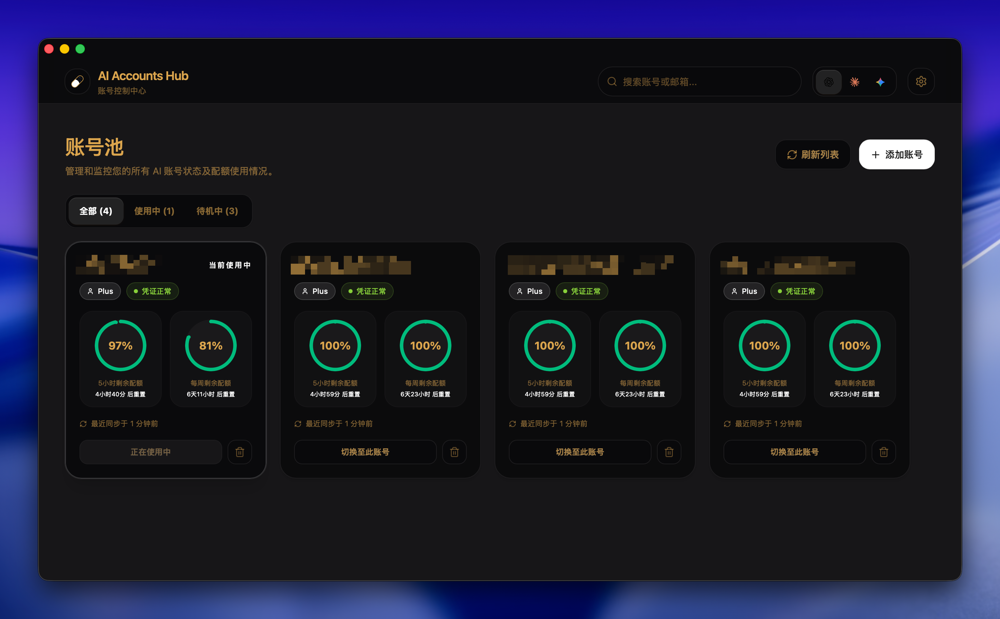
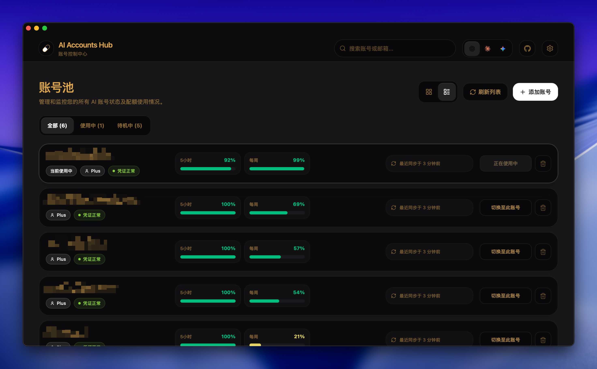
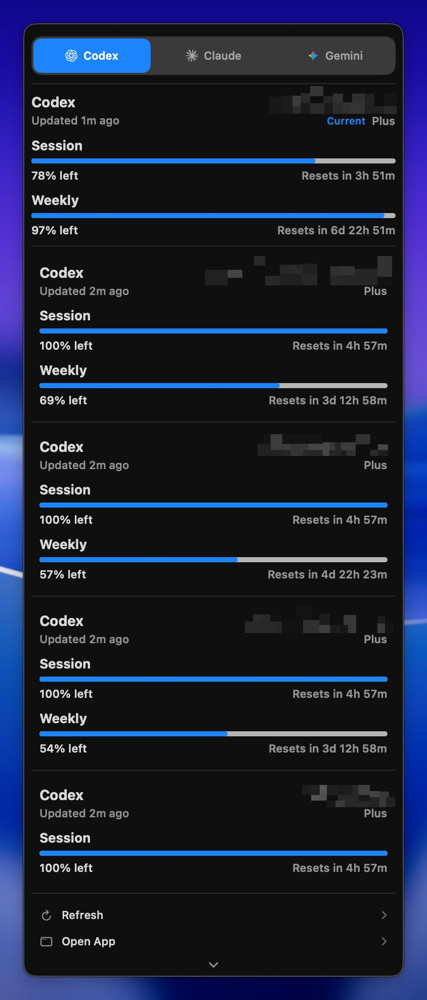

<p align="center">
  
</p>

<h1 align="center">AI Accounts Hub</h1>

<p align="center">
  <a href="https://github.com/murongg/ai-accounts-hub/releases"></a>
  <a href="https://www.npmjs.com/package/@murongg/aah-cli"></a>
  <a href="https://github.com/murongg/ai-accounts-hub/actions/workflows/ci.yml"></a>
  <a href="./LICENSE"></a>
  <a href="https://github.com/murongg/ai-accounts-hub/releases"></a>
  <a href="https://github.com/murongg/ai-accounts-hub/stargazers"></a>
</p>

<p align="center">
  <a href="https://github.com/murongg/ai-accounts-hub/releases"></a>
  <a href="https://tauri.app/"></a>
  <a href="https://react.dev/"></a>
  <a href="https://www.typescriptlang.org/"></a>
  <a href="https://www.rust-lang.org/"></a>
</p>

一个面向 AI CLI 重度用户的桌面账号中枢。

它把 `Codex`、`Claude`、`Gemini` 的多个登录态收进应用自己的账号池，并在需要时把选中的账号同步回系统 CLI 配置，让你可以在一台机器上快速切换“当前活跃账号”，同时查看各 provider 的配额或 usage 快照。

你可以把它当成两种模式来用：

- **桌面 App 模式**：用图形界面统一管理账号、切换系统当前凭证、查看 quota / usage、配置自动切换和本地中转服务。
- **CLI 模式**：安装 `aah` 后直接在终端里完成账号查看、切换、标记、删除、诊断、导入导出、刷新和 relay 管理；CLI 和桌面 App 共用同一个账号池与 relay 状态。

- 下载地址：[Latest Release](https://github.com/murongg/ai-accounts-hub/releases)
- 项目仓库：[murongg/ai-accounts-hub](https://github.com/murongg/ai-accounts-hub)

> 当前体验仍以 macOS 为主，但 Windows x64 已完成第一阶段适配：主窗口可以构建并启动。原生 menubar / 状态栏能力仅在 macOS 可用；Windows 当前阶段聚焦主界面可用，不承诺完整复刻 macOS 体验。

<table>
  <tr>
    <td width="66%">
      
      <br />
      
    </td>
    <td width="34%" align="center">
      
    </td>
  </tr>
</table>

## Sponsors

[](https://sponsorskit.vercel.app)

## 适用场景

- 同时维护多个 `Codex` / `Claude` / `Gemini` CLI 账号
- 经常在不同账号之间切换当前系统登录态
- 希望在切换前先看到剩余额度、刷新时间或账号健康状态
- 不想手动备份和覆盖 `~/.codex`、`~/.claude`、`~/.gemini` 下的凭证文件

## 两种使用模式

### 桌面 App 模式

适合把 AI Accounts Hub 当成主控台来用：

- 管理多 provider、多账号池
- 切换系统当前 live 凭证
- 查看 quota / usage / relogin 状态
- 配置自动切换、刷新间隔、数据目录和本地中转
- 使用 macOS menubar / 状态栏入口快速切换账号

### CLI 模式

适合已经长期在终端里工作，但又不想手动维护账号文件的人：

- 用 `aah add/list/current/switch/refresh` 管理账号
- 用 `aah label/remove` 维护账号显示名和账号池
- 用 TUI 的 `Codex` / `Claude` / `Gemini` provider tabs 进行交互式切换
- 用 JSON 输出做脚本集成，也可以用 `aah doctor` / `aah paths` 排查环境
- 用 `aah relay ...` 管理本地中转
- 与桌面 App 共享同一份账号池、配置和 relay 运行状态

## 已实现功能

- `Codex` / `Claude` / `Gemini` 多账号管理
- 首次启动自动导入当前系统已经登录的账号
- 桌面端支持 `Codex` 自动填充登录，输入邮箱和密码后通过官方登录页完成授权
- 一键切换当前系统 CLI 正在使用的登录态
- 主界面展示账号状态、剩余额度、刷新时间和 relogin 状态
- 后台定时刷新各 provider 配额快照
- 在主账号不可用或主配额耗尽时自动切换到可用账号
- 可选启动本地 `Codex` relay，并在桌面端与 CLI 之间共享同一个 relay 实例
- CLI 支持账号 label、删除、交互式 TUI、环境诊断、路径查看、shell completion 和自升级
- CLI 支持安全 metadata 导入导出，只迁移账号显示名等元数据，不导出 token 或凭证文件
- 设置页支持语言、主题、自动切换、刷新间隔、数据目录管理
- 内置桌面自动更新
- macOS 原生 menubar / 状态栏快速查看和切换

## Provider 支持

| Provider | 多账号池 | 切换系统登录态 | 配额 / Usage 快照 | 自动切换 |
| --- | --- | --- | --- | --- |
| Codex | 支持 | 支持 | `5h` / `Weekly` / `Credits` | 支持 |
| Claude | 支持 | 支持 | `Session` / `Weekly` / `Opus or Sonnet Weekly` | 支持 |
| Gemini | 支持 | 支持 | `Pro` / `Flash` / `Flash Lite` | 支持 |

## 账号托管模式

应用默认的工作方式不是“代理所有请求”，而是“托管账号凭证并切换系统当前账号”。

1. 首次启动时，应用会尝试把本机已经登录的 `Codex` / `Claude` / `Gemini` 账号导入自己的账号池。
2. 添加新账号时，应用会启动对应 provider 的官方登录流程，并把登录成功后的凭证收进账号池。
3. 每个账号都会隔离存放在应用数据目录里，而不是混在系统当前的 live 配置里。
4. 当你切换账号时，应用会把目标账号的凭证同步回对应 CLI 的系统路径。
5. 后台刷新任务会定时更新 usage / quota 快照，并在启用自动切换时选出仍然可用的账号。

当前会接管的 live 配置路径主要包括：

- `Codex`: `~/.codex/auth.json`
- `Claude`: `~/.claude/.credentials.json` 和 `~/.claude.json`
- `Gemini`: `~/.gemini/` 下的认证与设置文件

## 中转模式

如果你想在 `opencode` 或其他兼容 OpenAI/Codex 风格接口的 CLI 里使用 AI Accounts Hub 托管的账号，或者你想要更无感的账号切换体验，可以启用中转模式。

- relay 默认关闭，需要在桌面端设置页或 CLI 里显式启用
- 当前只提供 `Codex` 路由，不代理 `Claude` 或 `Gemini`
- 只监听 `127.0.0.1`
- 默认地址是 `http://127.0.0.1:8765/codex`
- 桌面端和 CLI 会共享同一个运行中的 relay 实例

启用后，你会得到：

- 给本地工具提供统一的 `Codex` 兼容入口
- 复用 AI Accounts Hub 已托管的 `Codex` 凭证
- 在桌面端和 CLI 之间共享同一套 relay 配置和运行时状态

相关状态文件：

- relay 配置保存在 `~/.ai-accounts-hub/settings.json`
- relay 运行时注册表保存在 `~/.ai-accounts-hub/relay/runtime.json`
- 如果使用 `--data-dir`，这两个文件都会跟着切到对应目录

## 配额数据来源

- `Codex`：读取已接入的 quota 接口并保存为本地快照
- `Claude`：优先读取 OAuth usage 接口；如果当前账号读不到该接口，则回退解析本机 `claude` CLI 的 `/usage` 输出
- `Gemini`：读取官方 quota 接口并展示 `Pro / Flash / Flash Lite`

这意味着：

- 应用展示的是 provider 级别的 usage / quota 快照
- 不同 provider 的可见字段，取决于对应 CLI 与上游接口是否能稳定返回数据
- 如果某个账号显示“当前没有 quota 数据”，通常表示该账号这次同步时没有拿到可用 usage 响应

## 快速开始

### 桌面 App 模式

如果你只想使用桌面应用，直接从 Releases 下载即可：

- [下载最新版本](https://github.com/murongg/ai-accounts-hub/releases)

在账号页添加 `Codex` 账号时，可以选择：

- **添加账号**：启动 `codex login` 的官方登录流程，按浏览器页面提示手动完成登录。
- **自动填充登录**：输入邮箱和密码后，应用会打开官方 `auth.openai.com` 登录页并自动填入账号密码；验证码、二次验证、Passkey 或风控确认仍需你在浏览器里手动完成。

自动填充登录需要本机可用的 Chrome 或 Chromium。密码只用于本次登录流程，不会写入账号池、日志或导出文件。

### CLI 模式

如果你只需要命令行版，可以单独安装 `aah` CLI，不需要安装桌面 app：

```bash
npm install -g @murongg/aah-cli
```

如果你不想依赖 npm，也可以在 macOS / Linux 上直接安装 Release 二进制：

```bash
curl -fsSL https://raw.githubusercontent.com/murongg/ai-accounts-hub/main/scripts/install-aah.sh | sh
```

指定版本或安装目录：

```bash
curl -fsSL https://raw.githubusercontent.com/murongg/ai-accounts-hub/main/scripts/install-aah.sh -o install-aah.sh
AAH_VERSION=0.1.5 sh install-aah.sh
AAH_INSTALL_DIR=/usr/local/bin sh install-aah.sh
```

启动交互式 TUI：

```bash
aah tui
```

在 TUI 里可以用 `1 Codex` / `2 Claude` / `3 Gemini` / `a All` provider tabs 过滤账号；账号列表会显示各 provider 的 quota 进度条和重置时间，详情面板会展开完整 quota 信息。用 `up/down` 或 `j/k` 选择账号，`Enter` 切换账号，`/` 搜索，`i` 查看详情，`l` 修改 label，`d` 删除账号，`r` 刷新 quota，`?` 查看快捷键，`q` 或 `Esc` 退出。

常用命令：

```bash
aah add --provider codex
aah add --provider codex --autofill --email user@example.com
aah list
aah current
aah refresh
aah switch --provider codex user@example.com
aah label --provider codex user@example.com Work
aah remove --provider codex user@example.com
aah doctor
aah paths
aah upgrade
```

`aah add --provider ...` 会启动对应 provider 的登录流程，把账号加入应用自己的账号池，但不会自动切换当前系统 CLI 正在使用的活跃账号。

`Codex` 也可以在 CLI 里使用自动填充登录：

```bash
aah add --provider codex --autofill --email user@example.com
```

默认会在终端里隐藏输入密码。如果要在脚本里使用，可以从 stdin 传入密码，避免把密码写进 shell history：

```bash
printf '%s\n' "$CODEX_PASSWORD" | aah add --provider codex --autofill --email user@example.com --password-stdin
```

CLI 自动填充登录和桌面端使用同一套官方 `auth.openai.com` 登录流程，需要本机可用的 Chrome 或 Chromium。验证码、二次验证、Passkey 或风控确认仍需你在浏览器里手动完成；密码只用于本次登录流程，不会写入账号池、日志或导出文件。

`aah switch/remove/label` 的账号选择器既可以传账号 email，也可以传托管账号 ID。`aah remove` 默认会交互确认；脚本里可以加 `--yes` 跳过确认。

账号显示名：

```bash
aah label --provider codex user@example.com Work
aah label --provider codex user@example.com --clear
```

安全导入导出账号元数据：

```bash
aah export --output accounts-metadata.json
aah import accounts-metadata.json
```

`aah export` 只导出 provider、账号 ID、email、label 等安全元数据，不导出 `auth.json`、OAuth token、Claude credentials 或 Gemini 凭证文件。`aah import` 只会把 metadata 应用到本机已经存在的托管账号；找不到匹配账号时会跳过，不会凭空创建账号或恢复凭证。

诊断和路径：

```bash
aah doctor
aah doctor --fix
aah paths
```

`aah doctor` 会检查 managed root、user home、relay 状态、provider CLI 是否可发现、账号数量、当前活跃账号和 relogin 风险。`aah doctor --fix` 会执行安全自动修复：补创建缺失的数据目录、规范化迁移后的托管账号路径、清理损坏或过期的 relay runtime 记录；它不会覆盖凭证、删除账号或自动重新登录。`aah paths` 会输出当前数据目录以及各 provider 被接管的账号、usage、live 配置路径，适合排查 `--data-dir` 和迁移问题。

生成 shell completion：

```bash
aah completion zsh > ~/.zfunc/_aah
aah completion fish > ~/.config/fish/completions/aah.fish
```

`aah upgrade` 会检查最新的 `cli-vX.Y.Z` CLI Release，自动识别当前 CLI 的安装方式，并在安全时直接升级。对于还没有安装元数据的旧版本安装，它可能会先输出一条手动升级命令，而不是直接覆盖当前安装。

按 provider 过滤：

```bash
aah list --provider codex
aah current --provider claude
aah refresh --provider gemini
```

输出 JSON，适合脚本集成：

```bash
aah add --provider codex --json
aah list --json
aah current --json
aah refresh --json
aah relay status --json
```

`--json` 只用于稳定的脚本输出命令。交互式或会写文件/修改账号池的命令，例如 `upgrade`、`tui`、`remove`、`label`、`export`、`import`、`doctor`、`paths` 和 `completion`，会保持人类可读输出。

管理本地 relay：

```bash
aah relay status
aah relay start --port 8765
aah relay stop
aah relay set-port 9876
```

其中：

- `aah relay start [--port ...]` 会把 relay 持久化设为启用，并确保后台实例正在运行
- `aah relay stop` 会把 relay 持久化设为关闭，并停止当前实例

指定数据目录：

```bash
aah --data-dir ~/.ai-accounts-hub list
```

默认情况下，CLI 会使用 `~/.ai-accounts-hub`。桌面 app 与 CLI 共享这个账号池目录；首次启动时会自动迁移旧桌面数据目录。CLI 使用独立版本线和 `cli-vX.Y.Z` Release tag，不和桌面 app 的 `vX.Y.Z` 版本耦合。

发布 CLI 新版本时使用独立 bump 命令和 tag 前缀：

```bash
pnpm bump:cli patch
git push --follow-tags
```

不要用 `v0.1.0` 这种 app tag 发布 CLI；CLI release workflow 只监听 `cli-v0.1.0` 这种 tag。

CLI npm 发布依赖 GitHub Secret `NPM_TOKEN`。如果 npm 账号开启了发布 2FA，这个 token 必须是 npm Automation token；普通 publish token 会在 GitHub Actions 中失败并提示 `EOTP`，因为 CI 无法交互输入一次性验证码。

如果你想从源码运行：

### 环境要求

- `Node.js 22+`
- `pnpm 10+`
- `Rust stable`
- 本机已安装对应 CLI：`codex` / `claude` / `gemini`
- 推荐在 macOS 或 Windows x64 上运行和验证

### 启动桌面应用

```bash
pnpm install
pnpm tauri dev
```

### 构建桌面应用

```bash
pnpm build
pnpm tauri build
```

### 运行测试

```bash
node --test src/lib/*.test.ts
cargo test --workspace
node --test packages/aah-cli/tests/*.test.mjs
```

> 如果你在 Linux 上本地构建 Tauri，需要额外安装 `libwebkit2gtk-4.1-dev` 等系统依赖，可直接参考 [`.github/workflows/ci.yml`](./.github/workflows/ci.yml)。
>
> 如果你在 Windows 上本地构建安装包，Tauri 会使用 WiX Toolset；首次构建可能需要联网下载 WiX 依赖。若只验证应用可执行文件是否生成，可先关注 `src-tauri/target/release/ai-accounts-hub.exe`。

## 仓库结构

- `src/`: React + Vite 前端界面
- `src-tauri/`: Tauri Rust 后端、账号存储、quota 刷新、自动切换、macOS 状态栏桥接
- `crates/aah-core/`: 桌面 app 与 CLI 共享的账号、存储、provider 和 relay 逻辑
- `crates/aah-cli/`: 独立 `aah` 命令行入口和 ratatui TUI
- `packages/aah-cli/`: npm 安装器包，安装时下载对应 CLI Release 二进制
- `website/`: 官网 / 下载页
- `screenshots/`: README 与官网素材

## License

本项目采用 `MIT` License，见 [LICENSE](./LICENSE)。

<p align="center">
  <a href="https://star-history.com/#murongg/ai-accounts-hub&Date">
    
  </a>
</p>
